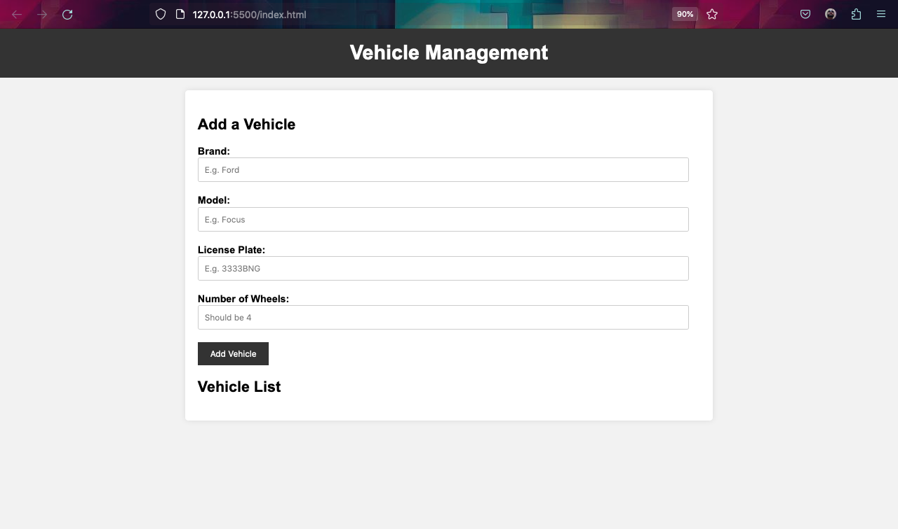

# Vehicle Management System

The Vehicle Management System is a simple web application that allows users to add and manage vehicles and cars. It provides a user-friendly interface for adding vehicles, displaying a list of vehicles, and performing basic operations on them.

## Features

- Add vehicles with brand, model, license plate, and number of wheels.
- Display a list of added vehicles.
- View detailed information about each vehicle.
- Validation to ensure all required fields are filled out.
- Validation for license plate format (4 digits followed by 3 letters).

## Technologies Used

- HTML
- CSS (for styling)
- JavaScript (for functionality)

## Usage

1. Clone the repository to your local machine:

```git clone https://github.com/jousemarquez/vehicle-management-system.git```


2. Open the `index.html` file in your web browser to access the application.

3. Fill out the required information in the form and click the "Add Vehicle" button to add a vehicle to the list.

4. View the list of added vehicles and their details.

## Screenshots



## Contributing

Contributions are welcome! If you have suggestions, feature requests, or want to report issues, please open an issue or create a pull request.

## License

This project is licensed under the MIT License. See the [LICENSE](LICENSE) file for details.

## Author

- [Jouse Márquez](https://github.com/jousemarquez)

Feel free to replace the placeholder content with your project-specific details, screenshots, and additional sections as needed. This `README.md` serves as a starting point for documenting your Vehicle Management System project.
